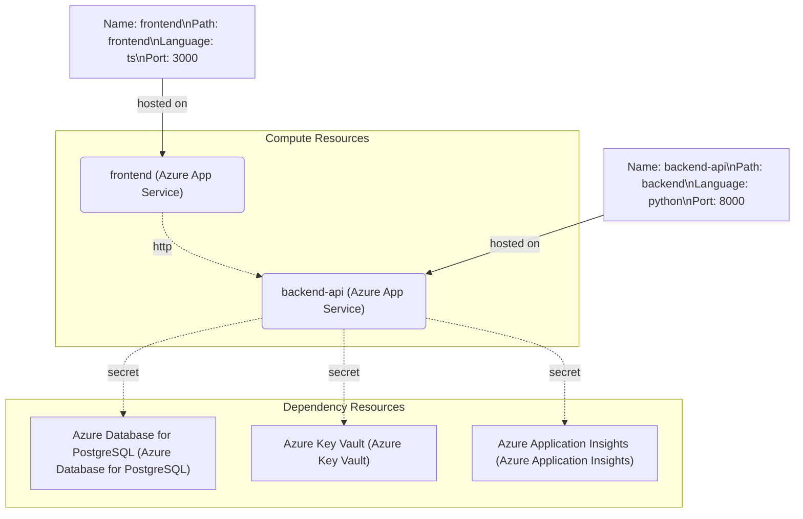

# Career Navigator Platform

Comprehensive learning + interview preparation platform built with a Next.js frontend and a FastAPI backend. It aggregates coding progress, recommendations, resume intelligence, mock interviews, and autonomous "AI agents" that turn telemetry into actionable plans.

## Features

- **Unified dashboard** – Next.js app surfaces progress analytics, recommendations, resumes/certifications, interview practice, and AI-driven actions.
- **Learning intelligence APIs** – FastAPI backend tracks recommendations, progress history, achievements, test scores, and certification uploads.
- **Profile integrations** – Pulls GitHub and LeetCode stats for each user to merge into a combined profile card.
- **Interview simulator** – Persona-based mock interview sessions with question rotation, scoring, speech analysis, and reporting endpoints.
- **Document pipeline** – Upload/analysis endpoints for resumes and certifications (PDF or image formats).
- **Automation agents** – Built-in `progress-coach` and `career-strategist` agents that synthesize recent telemetry and return actionable briefings via `/agents` endpoints.

## Project Structure

```
backend/
  main.py            # FastAPI app, Supabase auth, analytics + agent services
  requirements.txt   # Python dependencies
frontend/
  app/               # Next.js route handlers (dashboard, progress, interview, etc.)
  components/        # Reusable UI primitives (Radix-based)
  lib/api.ts         # Axios client + typed SDK for backend
  package.json       # Next.js scripts and dependencies
```

## Architecture Diagram

> Tip: install a Mermaid preview extension in VS Code to render the diagram visually.



## Tech Stack

- **Frontend**: Next.js 16 (App Router), React 19, Tailwind/postcss utilities, Radix UI, Zustand state, Recharts.
- **Backend**: FastAPI 0.110, Uvicorn, Supabase client SDK, httpx, python-dotenv, python-multipart.
- **Tooling**: pnpm (preferred) or npm for the frontend, pip/venv for backend, TypeScript 5, ESLint, TailwindCSS.

## Getting Started

### 1. Clone & prerequisites
- Node.js 18+ (Next.js 16 requirement)
- pnpm 9+ (or npm/yarn)
- Python 3.10+

### 2. Backend setup
```bash
cd backend
python -m venv .venv
source .venv/bin/activate  # Windows: .venv\Scripts\activate
pip install -r requirements.txt

# Environment variables (copy .env.example to .env first)
cp .env.example .env
```

Edit `.env` and provide:

| Key | Required | Description |
|-----|----------|-------------|
| `SUPABASE_URL` | ✅ | Supabase project URL (https://...). |
| `SUPABASE_SERVICE_ROLE_KEY` | ✅ | Service role key used for auth + profile sync. |
| `SUPABASE_ANON_KEY` | optional | Acts as fallback if the service role key is unavailable. |
| `ALLOWED_ORIGINS` | ✅ | Comma-separated list of frontend origins (prod domain, staging domain, localhost). |
| `GITHUB_TOKEN` | optional | Personal access token for higher GitHub API rate limits. |
| `ENABLE_MOCK_AUTH` | optional | Set `false` in production. Only use `true` for local testing without Supabase token checks. |

Run the API:

```bash
uvicorn main:app --reload --port 8000
```

### 3. Frontend setup
```bash
cd frontend
pnpm install
# copy env template and point it to your backend
cp .env.example .env.local
pnpm dev   # runs Next.js on http://localhost:3000
```

Set `NEXT_PUBLIC_API_BASE` inside `.env.local` (or hosting provider variables) to the publicly accessible FastAPI URL (e.g., `https://api.yourdomain.com`).

## Key API Surface

| Route | Description |
|-------|-------------|
| `POST /auth/signup`, `POST /auth/login` | Supabase-backed auth helpers. |
| `GET /profile/{leetcode}/{github}` | Combined profile fetch. |
| `GET /dashboard/overview` | Bundled resumes, test scores, certifications, recommendations, and progress stats. |
| `GET /progress/stats`, `/progress/history`, `/achievements` | Learning telemetry feeds. |
| `POST /resume/upload`, `POST /resume/{id}/analyze` | Resume ingestion + AI analysis stub. |
| `POST /certifications` | Certification upload (multipart). |
| `POST /interview/start`, `/interview/{session}/answer`, `/interview/{session}/report` | Persona-driven mock interview workflow. |
| `GET /agents` | Lists available automation agents (`progress-coach`, `career-strategist`). |
| `POST /agents/run` | Executes an agent with optional inputs (`days`, `company`, etc.) and stores the run digest. |
| `GET /agents/runs`, `/agents/runs/{run_id}` | Inspect historical agent runs held in-memory. |

Refer to `frontend/lib/api.ts` for the typed client covering all endpoints.

## Development Notes

- Frontend uses the App Router (`app/` directory) with server components and co-located styles.
- Global state (user auth) lives in `lib/store.ts` via Zustand; API module handles token injection.
- New automation agents can be added by expanding the FastAPI `AGENT_CATALOG`, wiring an executor, and optionally surfacing a UI trigger.
- Dashboard charts now display live backend data (no hard-coded demo numbers) and gracefully handle missing telemetry.

## Scripts & Linting

```bash
# Frontend
pnpm lint      # ESLint
pnpm build     # Production Next.js build
pnpm start     # Run built app

# Backend
uvicorn main:app --reload  # hot-reload server
```

## Deployment Tips

- Serve the backend behind a production ASGI server (e.g., `uvicorn --workers 4` or Gunicorn with Uvicorn workers).
- Next.js app can be deployed on Vercel or any Node-friendly host; remember to set `NEXT_PUBLIC_API_BASE` to your backend URL.
- Configure Supabase service credentials securely (environment variables in your hosting provider).
- Persist agent runs if you need durability: plug `_store_agent_run` into a database in place of in-memory storage.
- Do not enable mock auth in production (`ENABLE_MOCK_AUTH=false`).

### Deployment Checklist

1. Copy the provided `.env.example` files (both backend and frontend) and fill in production values, including every allowed frontend origin.
2. Run `pnpm build` from `/frontend`; the build now fails on TypeScript errors, which prevents shipping broken client bundles.
3. Run `uvicorn main:app --host 0.0.0.0 --port 8000` (or your preferred ASGI server) with the same environment variables you validated locally.
4. Provide the backend base URL to the frontend via `NEXT_PUBLIC_API_BASE` so API calls never target localhost in production.
5. Configure HTTPS and a CDN (e.g., Vercel/Azure Front Door) to front the Next.js site, and ensure the backend only allows the production origins you listed in `ALLOWED_ORIGINS`.
6. Validate startup by checking `GET /health` and that authenticated routes reject invalid bearer tokens.

## License

Copyright © 2026. All rights reserved.
